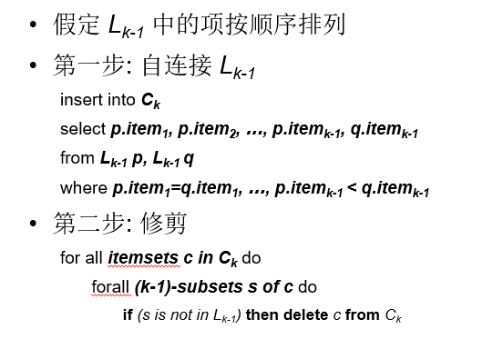
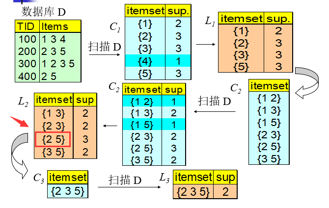
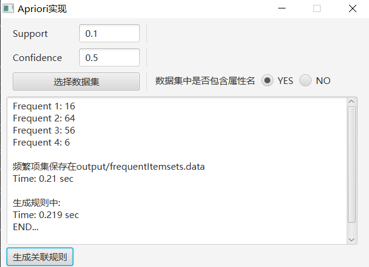
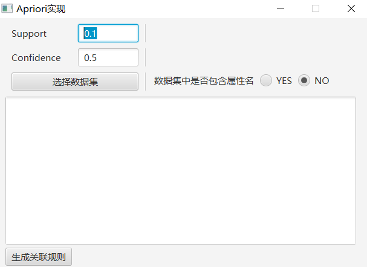
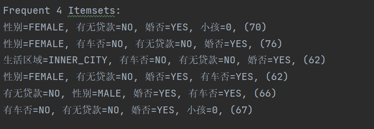
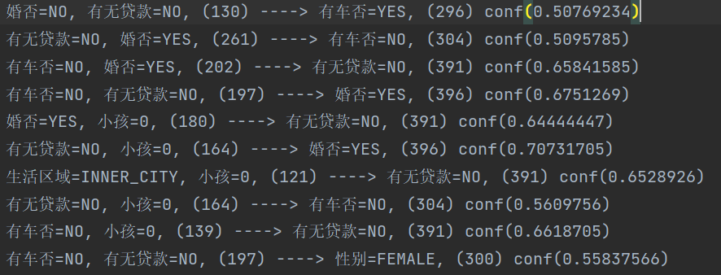

> 重新用Python实现了Apriori，也算是对老师当初说“老师，我一定会重新再写一下的”的完成吧😂

<!--truncate-->


对于Aprior的基本介绍，事务，项集等等，我就不详细说了，网上很多，这里推荐一个 [数据挖掘与Aprior](https://wenku.baidu.com/view/3cf2e25a4028915f814dc264.html)，讲的很详细。


<details>
  <summary>这里给一个<code>数据集</code></summary>

链接: https://pan.baidu.com/s/13k8cAo6czlBTRMzX8Ml5xg 提取码: 8wun (这个链接经提醒已经挂了) 

链接: https://pan.baidu.com/s/1AeYRoyvfCb5FRCdhduMO-A 提取码: 9ysz 

PPT 
链接: https://pan.baidu.com/s/1erls8n4kVCucqlqeQwcmsg 提取码: ktwx 

</details>


1. 算法步骤: 

    

2. 主要说一下网上都没有说的问题:  
      
    为什么Aprior要假定Lk-1为按顺序排列？
    到底是哪些东西，按照什么顺序排列？

    
      

    如上图中红色框住的，是一个项集，排序就是排他内部项目的序号，2，5。所谓的排序指的是，一个项集中的项目item，按照自定的顺序排序，当然，排序规则你自己定，但是为了方便我们一般就按本身的sort()函数来排序  
    为什么要 排序 呢？  
    这是因为  当你 `连接步` 的时候，你要判断两个项集前 k-1 项是相同的，然后才能 `生成Cn`（详见PPT），这个有序其实就是为了简化 操作，你不必找出二者 `不同` 的那个 项目在哪里，因为他只可能在末尾。


3. 数据结构  map(frozenset, int) ，
    frozenset 是因为map不允许把set当作key值，因为set由增删功能，会改变key。
4. 源代码 
    <details>
      <summary>下面是<code>python</code>版本的代码</summary>

    ```python
    def getData():
        f = open("./dataMining/retail.dat")
        data = f.readlines()
        ls = []
        for line in data:
            line = line.replace("\n","")
            line = line[:-1]
            ls.append(list(line.split(' ')))
        f.close()
        return ls

    def genK1(database, support):
        k = {}
        k1 = {}
        for row in database:
            for col in row:
                k[col] = k.get(col, 0) + 1
        for key in k.keys():
            if k[key] >= support:
                s = set()
                s.add(key)
                ss = frozenset(s)
                k1[ss] = k[key]
        return k1

    def showKn(kn, n):
        print('k' + str(n) + ':')
        print('count is ' + str(len(kn)))
        for s in kn.keys():
            l = list(s)
            l.sort()
            print("({}, {})".format(l, kn.get(s)))

    def selfJoin(km):
        cn = {}
        for s1 in km.keys():
            ls1 = list(s1)
            ls1.sort()
            if len(ls1) == 1:
                s1sub = set()
            else:
                s1sub = set(ls1[:-1])
            for s2 in km.keys():
                if s2 != s1:
                    ls2 = list(s2)
                    ls2.sort()
                    if len(ls2) == 1:
                        s2sub = set()
                    else:
                        s2sub = set(ls2[:-1])
                    if s1sub == s2sub:
                        l = ls1.copy()
                        l.append(ls2[-1])
                        l.sort()
                        # s = set(l)
                        ss = frozenset(l)
                        cn[ss] = 0
        return cn

    def cut(cn, km):
        #km是 n-1位的频繁项，cn是预备项
        cnCutted = cn.copy()
        for s in cn.keys():
            s1 = set(s)
            for i in s1:
                s2 = s1.copy()
                s2.remove(i)
                s2 = frozenset(s2)
                if s2 not in km:
                    # if s in cnCutted.keys():
                    #     del cnCutted[s]
                    #当一个s 由于他的子序列 不是频繁的而被删除时,
                    #应当break，他已经完成了  删除了 ，或者增加判断语句
                    del cnCutted[s]     
                    break
        return cnCutted

    def genCn(km, n):
        cn = selfJoin(km)
        # showKn(cn, n)  剪枝前
        cnCutted = cut(cn, km)
        # showKn(cnCutted, n)  剪枝后
        return cnCutted

    def getItemsCount(t, database):
        #遍历数据库
        t = set(t)
        count = 0
        for row in database:
            flag = 1
            for item in t:
                if item not in row:
                    flag = 0
                    break
            if flag == 1:
                count = count + 1
        return count

    def getKnNext(cnNext, database, support):
        knNext1 = {}
        knNext = {}
        for t in cnNext.keys():
            tCount = getItemsCount(t, database)
            knNext1[t] = tCount
        for i in knNext1.keys():
            if knNext1[i] >= support:
                knNext[i] = knNext1[i]
        return knNext

    def main():
        support = 88162*0.02
        database = getData()
        k1 = genK1(database, support)
        kn = k1
        n = 1
        while len(kn) != 0:
            showKn(kn, n)
            n = n + 1
            cnNext = genCn(kn, n)
            kn = getKnNext(cnNext, database, support)

    main()

    ```
    </details>

5. 新增完整的 **gui** 界面，从Apriori到 **规则生成** 

   


   - :white_check_mark: 两种数据格式——是否带列名 

     

     

   - :white_check_mark: gui界面  

     

   - :white_check_mark: 频繁项集展示  

     

   - :white_check_mark: 规则生成展示  
   
     