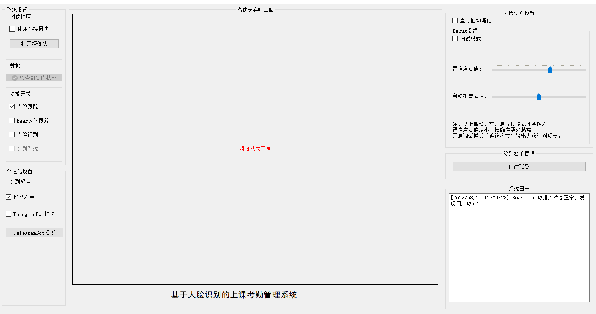

## 项目介绍

本项目基于OpenCV使用Haar级联分类器实现人脸检测，与dlib库进行实时跟踪，应用LBPH算法开发了一个功能相对完整的人脸识别系统。系统采用MySQL进行数据存储，能够进行学生上课考勤人脸点名的功能，并拥有基于PyQt5设计的GUI实现。

## 系统架构

### 核心部分 core.py

### 人脸采集

### 数据管理

## 树莓派

### 硬件

树莓派3b+, 32G tf 卡, 谷客外接摄像头

### 照片

.jpg)
.jpg)
.jpg)
.jpg)

