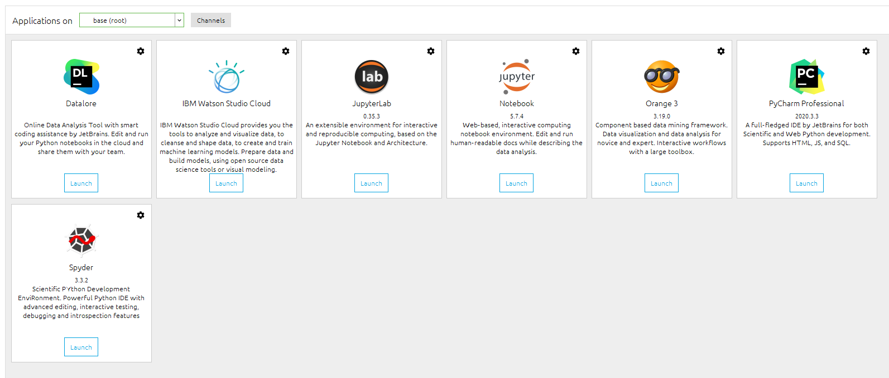

> 对于python开发，我建议直接安装Anaconda，而不是按照网上的安装python3.7或者2.7什么的
> 1. python的开发中，我们需要很多的开发环境不断切换，我们最好的是建立好几个单独的环境
> 2. Anaconda可以快速部署一个开发环境，只需要 **三分钟** 就可以，而且可以根据需求切换
> 3. 使用Anaconda搭建好当前项目的开发环境之后，我们可以选择 `Pycharm` `Jupyter` `VScode` `spyder`等等作为我们的IDE

## 安装Anaconda

### 下载Anaconda 
我们不在官网下载，速度太慢，前往[清华镜像站](https://mirrors.tuna.tsinghua.edu.cn/anaconda/archive/?C=M&O=D)下载 

### 配置Anaconda
 
 
 
 
 
 

### 配置环境变量

> E:\Anaconda（Python需要）  
> E:\Anaconda\Scripts（conda自带脚本）  
> E:\Anaconda\Library\mingw-w64\bin（使用C with python的时候）   
> E:\Anaconda\Library\usr\bin  
> E:\Anaconda\Library\bin（jupyter notebook动态库）  

### 校验

打开cmd校验上一步是否成功配置完成
1. 输入python  

2. 输入conda  

### 为anaconda增加中国镜像（解决下载速度慢的问题）  
在 `Anaconda prompt` 中操作：  
> conda config --add channels https://mirrors.tuna.tsinghua.edu.cn/anaconda/pkgs/free/  
> conda config --add channels https://mirrors.tuna.tsinghua.edu.cn/anaconda/pkgs/main/  
> conda config --set show_channel_urls yes  

### 恭喜，至此环境已经全部安装完成

## 选择合适自己的IDE  
1. 使用原生的anaconda + jupyter + Spyder
打开 anaconda，安装jupyter和spyder  
  
点击launch登录  
  
新建notebook  

开始编写代码  
  

