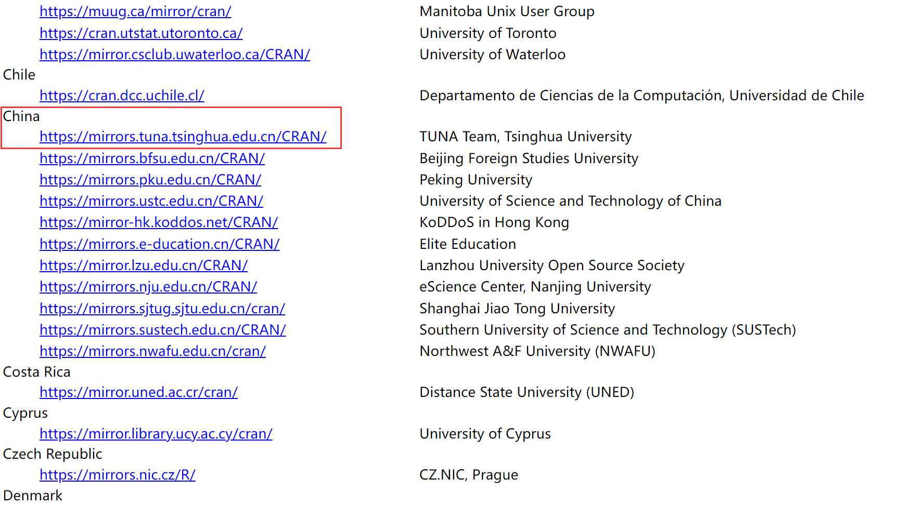
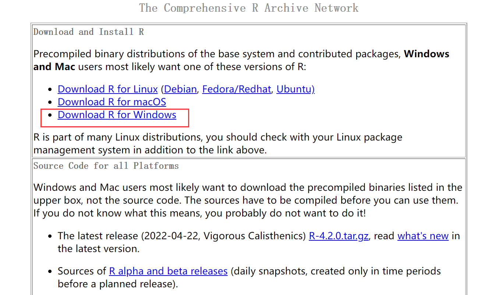
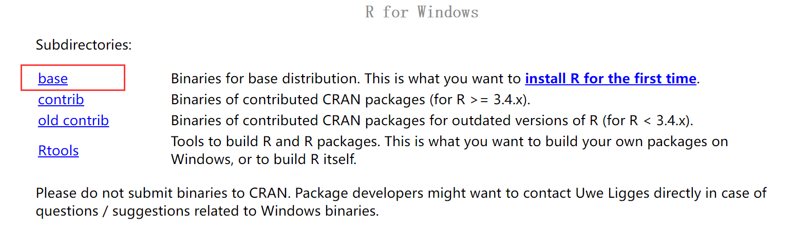

## R下载与安装

由于R下载速度较慢，所以我们选择镜像网站下载

[下载地址](https://cran.r-project.org/mirrors.html)

1. 选择镜像地址 China

 

2. 选择对应平台 我们这里选择windows

 

3. 选择base版本

 

## R studio下载与安装

R studio是R的一个IDE，由于比较好用功能强大，用R语言的都一般都会装这个。R studio是ide(集成开发环境)，ide让你更方便地开发。没有R的ide无法启动，所以一定要先安装好R再安装R studio。

打开链接 [Download the RStudio IDE](https://www.rstudio.com/products/rstudio/download/) 往下拉，选择 Free 版本进行下载安装。
